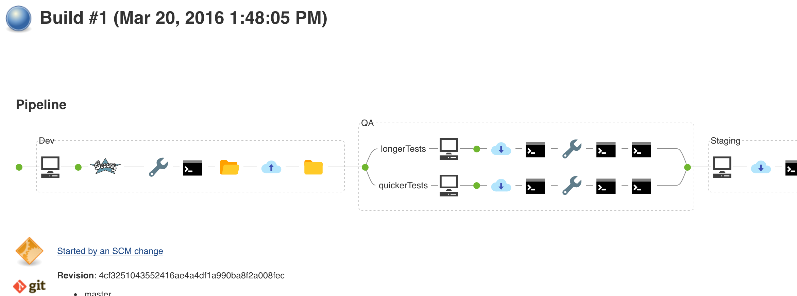

# pipeline-view-plugin [](https://gitter.im/jenkinsci/pipeline-view-plugin?utm_source=badge&utm_medium=badge&utm_campaign=pr-badge) [](https://circleci.com/gh/jenkinsci/pipeline-view-plugin/tree/master)
Jenkins Pipeline (aka Workflow) viewer



# Installation
Currently plugin is in alpha stage and not released yet. However, you can download the latest build from CircleCI: https://circleci.com/gh/jenkinsci/pipeline-view-plugin/tree/master . Navigate to the latest green build, select "Artifacts" tab and download `pipeline-view.hpi`.

you can also build it yourself to get `*.hpi` file. Luckily, it's as simple as:

```bash
./gradlew build
```

Then just use `build/libs/pipeline-view.hpi` as any other Jenkins plugin.

# Architecture
Plugin contains two parts - backend and frontend.

### Backend
Backend is a standard Java Jenkins API and uses Jackson to serialize actions to JSON. Why not stapler? Because currently it has no class info and action fields are not exported.

### Frontend
Frontend is a React application. It uses RxJS for polling data from the server and ImmutableJS to skip processing of already processed data. Webpack is being used to compile JS.


## Development
First, you need running Jenkins. You can do it in 3 ways:

1. With Gradle: `./gradlew server`

1. With Docker Compose: `docker-compose up`

1. Reusing existing Jenkins with already installed plugin (if you want to hack on the frontend only).

Then, start webpack-dev-server:

1. With NPM: `npm run serve`

1. With Gradle (it will call NPM under the hood) (**NOTE:** `serve` is **not** a typo ): `./gradlew serve`

webpack-dev-server will listen on port 3000 and will proxy all requests except plugin's JS files to the localhost:8080. It means that if you have a running Jenkins instance on `http://localhost:8080`, then you can open `http://localhost:3000` and you will see you Jenkins instance. But! You can open `http://localhost:3000/webpack-dev-server/` and it will reload your app every time frontend is changed.
